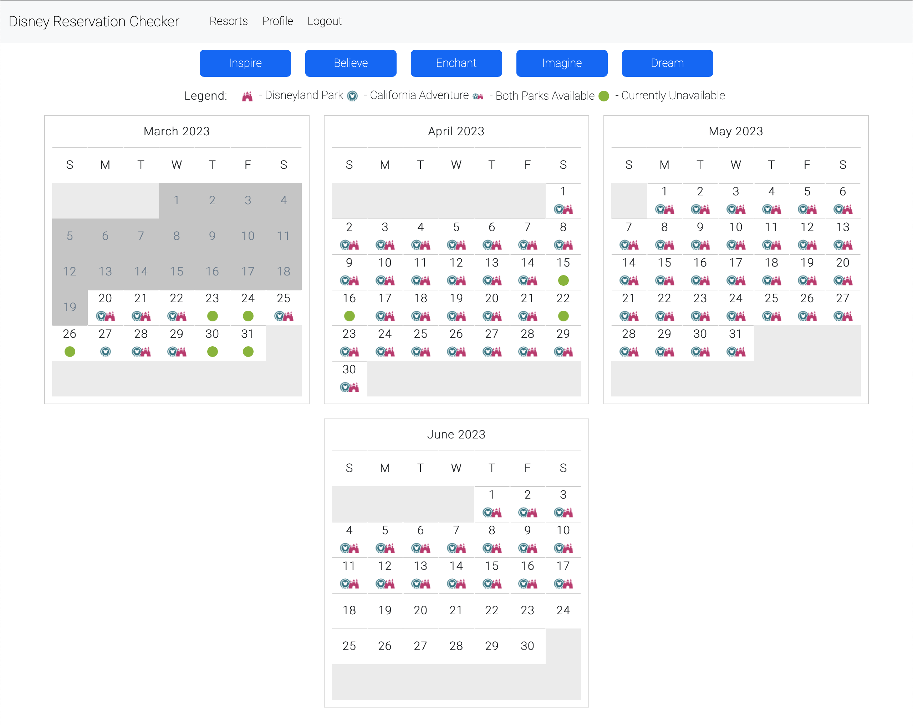
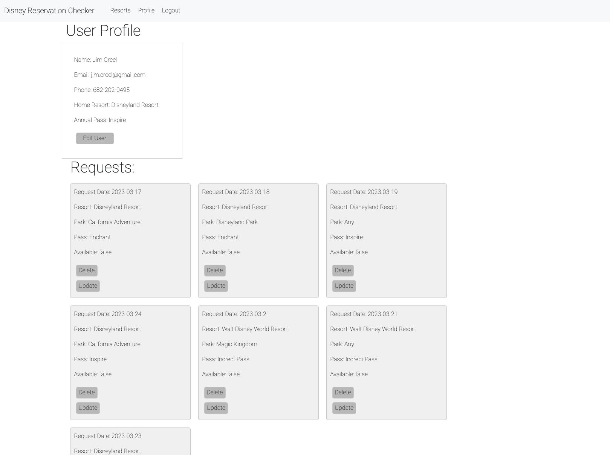
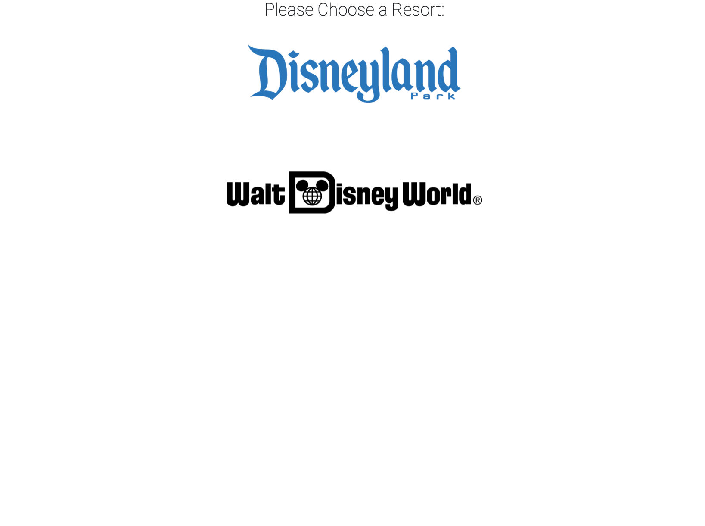
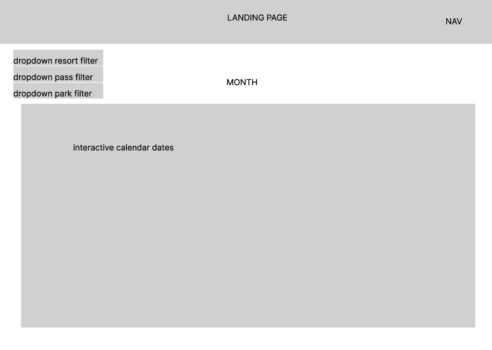
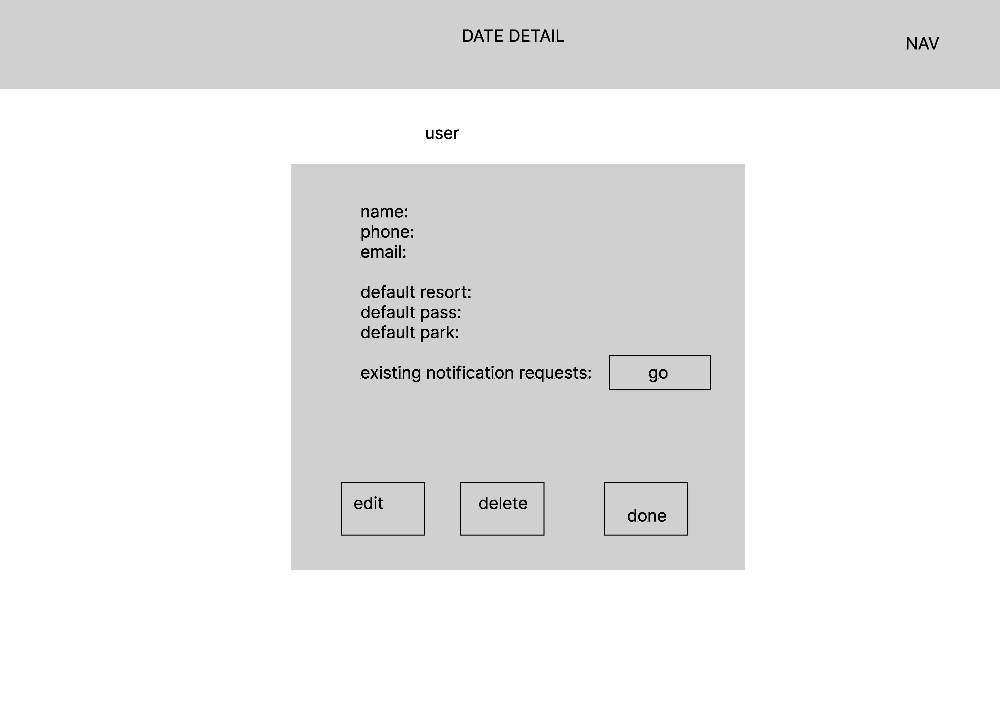
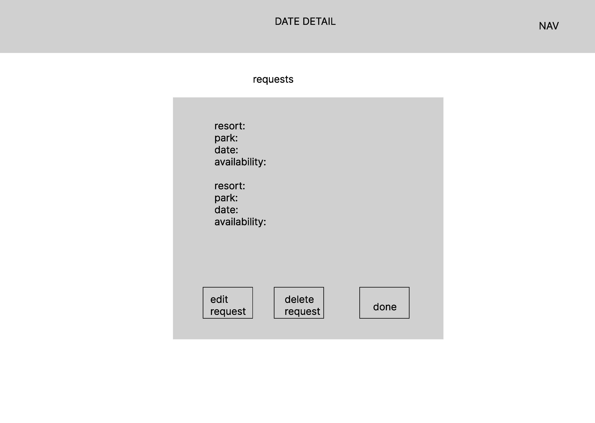

# Disney Reservation Checker

## Technologies Used

- JavaScript
- HTML
- CSS
- Bootstrap
- Axios
- AWS
- express.js
- node.js
- React
## Installation Instructions

- clone the repository
- run npm install
- run npm run start
- open a browser to localhost on the specified port

## User Stories

- As an annual pass holder, I want to be able to receive notifications for days that are full when they become available

- As a recruiter, I want to see how the candidate handles data manipulation from external APIs and databases

- As a headhunter, I want to quickly identify people who demonstrate a potential for interesting work, so that I can see how they fit within the existing framework of my agency.

## Wireframes

>

## Unsolved Problems

- authorization will be re-implemented in the near future. 
- the app has moved to a react front end with separate express backend. 