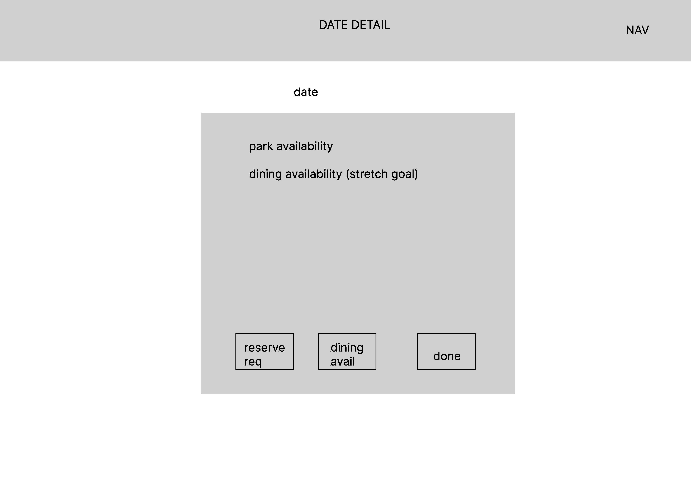

# Disney Reservation Checker

## Technologies Used

- JavaScript
- HTML
- CSS
- Bootstrap
- Axios
- AWS
- express.js
- node.js

## Installation Instructions

- clone the repository
- install node.js
- run node server.js

## User Stories

- As an annual pass holder, I want to be able to receive notifications for days that are full when they become available

- As a recruiter, I want to see how the candidate handles data manipulation from external APIs and databases

- As a headhunter, I want to quickly identify people who demonstrate a potential for interesting work, so that I can see how they fit within the existing framework of my agency.

## Wireframes

>

## Unsolved Problems

- i'm working to integrate the python backend script with mongodb. The original uses a POSTgres db, so as of now it will not send notifications. 
- styling is basic in some areas due to authorization. hopefully will be working through that soon. 
- google authentication is required, which may prevent some users from using the site
